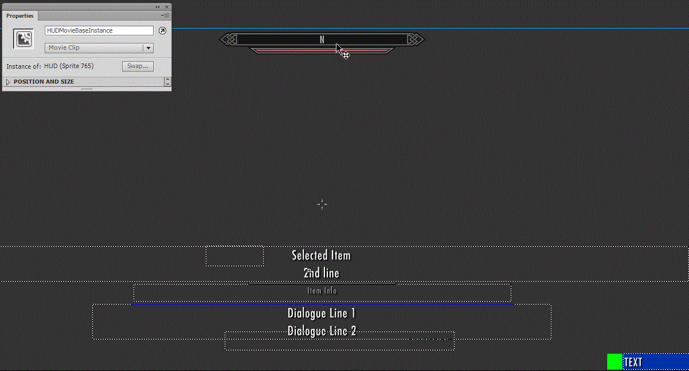
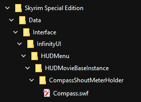

# 

Infinity UI is a framework that allows to add or replace individual elements in any UI menu, be those menus vanilla or added by mods.

The widget manager feature of SkyUI allowed adding widgets only in the HUD and no replacement, but for certain cases, that functionality needed to be extended.

To keep compatibility, UI modders have needed to create other menus and put them on top, adding extra logic to work around the fact that the elements added do not belong to the target menus. Infinity UI aims to solve this in a user-friendly way, by loading SWF files from a preset folder to the in-game menus. Simple as that.

All of this also means that it becomes possible to re-skin individual elements of the UI without touching the rest. Combining alternatives that match a theme and with good taste, a UI can look amazing and unique.

[Compass Navigation Overhaul](https://www.nexusmods.com/skyrimspecialedition/mods/74484/) makes use of this framework to extend the compass functionality with quality-of-life features seen in games such as God of War, Assassin's Creed, Horizon, etc. It also displays a quest list in the HUD when you focus a quest marker in the compass. If you want an in-game example of what this framework enables to do, go check it now!

If you read up to this point, you may be interested on giving it a try in your mod list.  So... back to Skyrim again?

Check the list in the Requirements dropdown on the Nexus mod page. **Not complying to those will almost surely result in CTD.**

Use a mod manager of your choice and install it as any other mod. For manual installation, copy the contents of the .RAR file into the Data folder under your Skyrim installation path.

This mod is compatible with **any** mod created, as of today.

**Skyrim VR version soon.**

Install this plugin. Follow the instructions provided by the UI-mod authors in their pages.

Create a folder named "InfinityUI" in "Data/Interface". This will be the starting path to search any menu modification.

Inside this folder, create a folder with the name of the menu that you want to mod.

Replicate the path to the element of the UI that you wanted to add/replace by nesting folders inside the menu folder. You can check the path to each nested UI element in the FLA/AS files of the [SkyrimUI SDK Repo](https://github.com/Mardoxx/skyrimui), from the mod sources if the author provided them, or you can decompile the SWF yourself with a tool like [JPEXS Free Flash Decompiler](https://github.com/jindrapetrik/jpexs-decompiler/releases).

Use Adobe Flash CS6 to build the SWF file that will be the patch. Copy the SWF file to the folder that replicates the name of the parent where you want to nest it.

If the file name matches the one of an existing child in the menu, instead of creating a new one, the existing one will be replaced. For example, to replace the compass in the HUD menu, first we need to know the path that we need to create. Opening the hudmenu.fla from the [SkyrimUI SDK Repo](https://github.com/Mardoxx/skyrimui) we can get it:

The compass element is named Compass, so we name the SWF file "Compass.swf".
The path is HUDMovieBaseInstance -> CompassShoutMeterHolder -> Compass, so the resulting folder-file structure is the following:

*Note: Logically, when replacing, any MovieClip reference to the old UI element has to be reassigned to the new element, because the old one does not exist then. Check the ActionScript code of the menu to see where the MovieClip that is the target UI element or its children are referenced.

When you have the SWF files in their corresponding paths, the modded UI elements can be managed as if they were vanilla: using the [Papyrus UI script](https://www.creationkit.com/index.php?title=UI_Script), or C++ Scaleform for an SKSE plugin.

In the Files section you can find the API for this framework. This API will send events for the different loading stages for the menu and the patches, so that you can take actions in between of each stage (reposition elements, assign values, etc.)

For the moment, the API is for C++ only. In future updates I will add more functionalities, such as inspecting members of UI elements from your code.

- [distar66](https://www.nexusmods.com/skyrimspecialedition/users/44417112) for making the call that finally motivated me to start learning RE and get into modding
- [Fludgyduff](https://www.nexusmods.com/skyrimspecialedition/users/5687342) (Ryan) for his invaluable SSE RE library [CommonLibSSE](https://github.com/Ryan-rsm-McKenzie/CommonLibSSE), that set the ground for others
- [CharmedBaryon](https://www.nexusmods.com/skyrimspecialedition/users/55142267) for improving Ryan's job with [CommonLibSSE-NG](https://github.com/CharmedBaryon/CommonLibSSE-NG)
- [meh321](https://www.nexusmods.com/skyrimspecialedition/users/2964753) for [Address Library for SKSE Plugins](https://www.nexusmods.com/skyrimspecialedition/mods/32444)
- The SKSE team for one of the most (if not THE most) useful contributions to SSE modding: [SKSE64](https://skse.silverlock.org/)
- [Maddox](https://www.nexusmods.com/skyrimspecialedition/users/446046) for the super useful [SkyrimUI SDK](https://github.com/Mardoxx/skyrimui)
- [Schlangster](https://www.nexusmods.com/skyrimspecialedition/users/28794) and the whole SkyUI Team for the legendary [SkyUI](https://www.nexusmods.com/skyrimspecialedition/mods/12604)

These people are awesome and very talented, so go check their job, download it, and don't forget to endorse :)
Also, all the patrons that made it possible, with special mention to:

- [Євгеній Шевченко](https://www.patreon.com/user?u=78011660)
- [xaliber](https://www.patreon.com/user?u=7623378)
- [Joey](https://www.patreon.com/user?u=25462713)
- [HeathenHipster](https://www.patreon.com/user?u=78702667)
- [Tee DjY](https://www.patreon.com/user?u=53969324)
- [Nacalar](https://www.patreon.com/user?u=24009493)
- [Alex](https://www.patreon.com/user?u=57067662)
- [Tate Paterson Hughes](https://www.patreon.com/user?u=77998073)
- [Mason Berry](https://www.patreon.com/user?u=4211047)
- [Scott Whiting](https://www.patreon.com/user?u=182304)
- [Khenta](https://www.patreon.com/user?u=37906172)
- [Jyakob](https://www.patreon.com/user?u=14884985)
- [Miss Magpie](https://www.patreon.com/user?u=57981778)
- [Urukass](https://www.patreon.com/user?u=66262105)
- [Garrett H.](https://www.patreon.com/user?u=24353831)
- [VVSCloud](https://www.patreon.com/user?u=20753173)
- [Brendan Gysbers](https://www.patreon.com/user?u=12612990)

You guys are the best!

Nexus Mods: <https://www.nexusmods.com/skyrimspecialedition/mods/74483>

Source Code: <https://github.com/alexsylex/InfinityUI>
